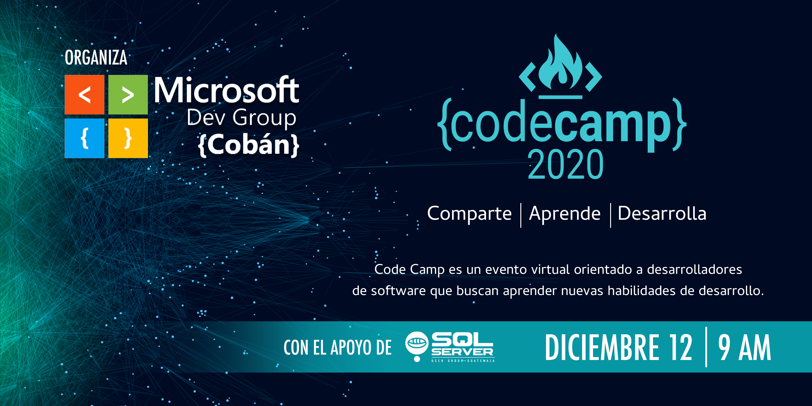

# Code Camp 2021
```
Comparte | Aprende | Desarrolla
```

Code Camp es un evento virtual organizado por la comunidad [Microsoft Dev Group Cobán](https://www.facebook.com/groups/MsDevGroupCoban), orientado a desarrolladores de software que buscan aprender nuevas habilidades de desarrollo.

Nuestro objetivo es mejorar tus habilidades técnicas preparándote para el éxito con las herramientas adecuadas, ya sea para mejorar en tu trabajo actual, o prepararte para tu siguiente reto profesional.


Para obtener más información específica sobre la agenda y presentaciones, consulta acá:
* [Agenda](Agenda.md)
* [Business Coaching para Startups](Foro.md)
* [Presentaciones](Presentaciones.md)

Este evento será **totalmente GRATUITO**, así que únicamente tienes que asistir al evento via YouTube o Facebook live.
Para más información y registro de este evento click [aqui](https://codecamp-2021.eventbrite.com).  


# Sponsors

Un agradecimiento especial a nuestros patrocinadores, sin ellos este evento no sería posible.

* [RedGate](https://www.red-gate.com)  
Redgate Software es una empresa de software con sede en Cambridge, Inglaterra. Desarrolla herramientas para desarrolladores y profesionales de datos y mantiene sitios web comunitarios como SQL Server Central y Simple Talk.  

    Te invitamos a registrarte en el proximo Redgate Summit - The future of database DevOps
    [](https://www.red-gate.com/hub/events/redgate-summit-the-future-of-database-devops)

* [O'Reilly](https://www.oreilly.com/)  
O'Reilly Media, antes llamada O'Reilly & Associates, es una empresa editorial estadounidense fundada y dirigida por Tim O'Reilly que está principalmente enfocada a libros de tecnología e informática. Usa como distintivo en sus portadas diferentes animales, como un camello, un mouse o una llama.

     

# ¿Dudas? 

Seguinos en [Facebook](https://www.facebook.com/groups/MsDevGroupCoban) para conocer más acerca de este y otros eventos.

# Siguenos
[](https://github.com/msdgc)[](https://www.facebook.com/groups/MsDevGroupCoban)
